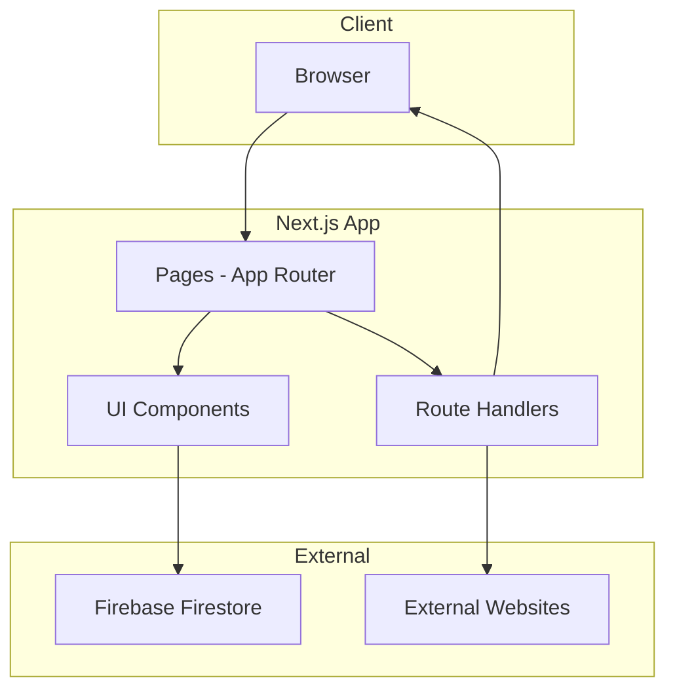
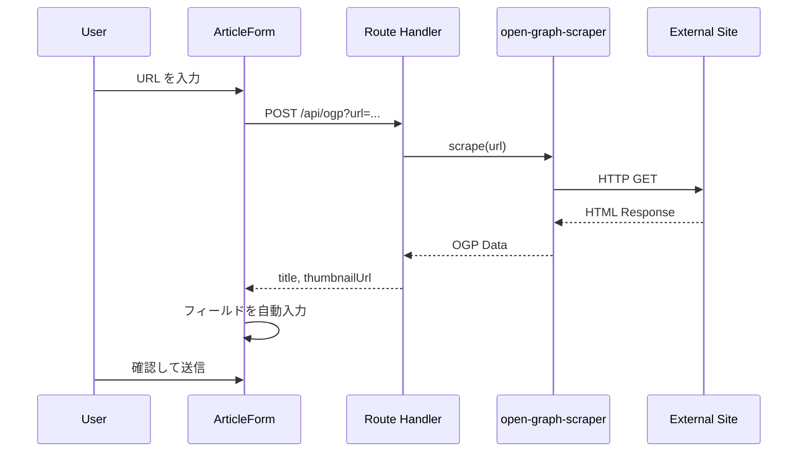
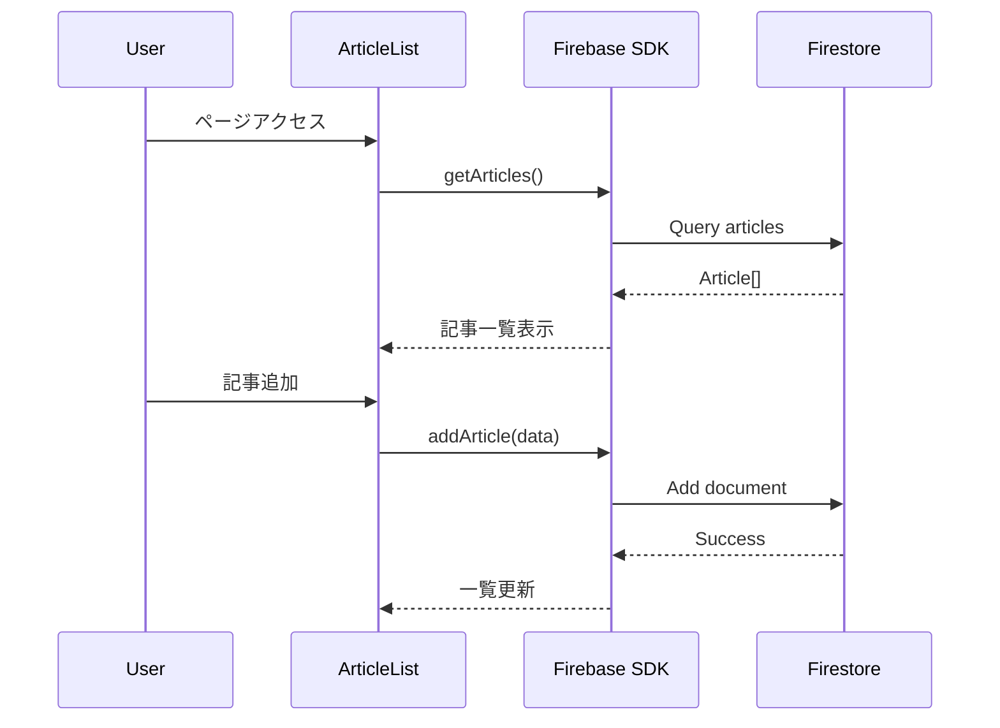
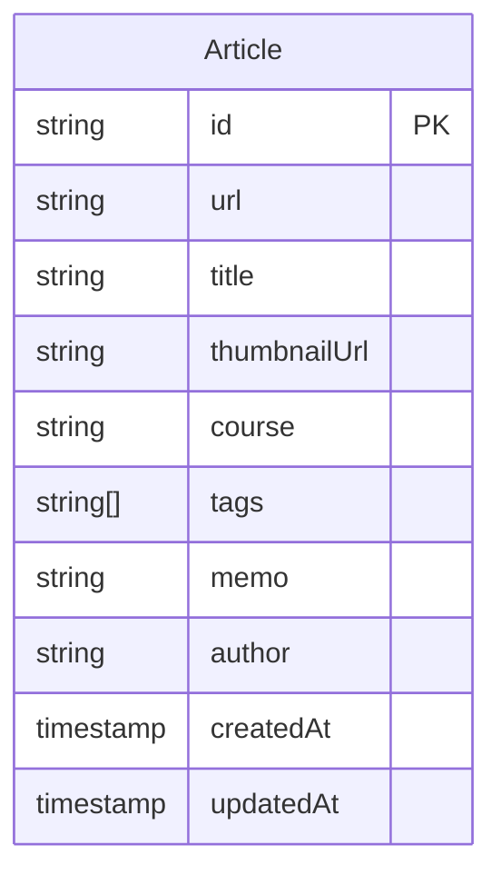

# Technical Design Document

## Overview

**Purpose**: Tech Terminal は、プログラミングスクールのメンター向け技術記事ナレッジベースを提供する。URL ブックマーク登録、OGP 自動取得、分類・タグ付け、検索・フィルタリング機能により、散在する技術ノウハウを一元管理する。

**Users**: プログラミングスクールのメンター（スタッフ）が、技術記事の共有・蓄積・検索に使用する。

**Impact**: 新規プロジェクトとして、Next.js App Router + Firebase Firestore でフルスタックアプリケーションを構築する。

### Goals
- 技術記事を URL で簡単に登録できる
- OGP からタイトル・サムネイルを自動取得し、登録の手間を削減
- コース・タグ・キーワードで記事を効率的に検索・フィルタリング
- レスポンシブ UI で PC・モバイル両対応

### Non-Goals
- ユーザー認証（MVP スコープ外）
- いいね/おすすめ度機能
- 学習パス（カリキュラム化）
- Slack 連携

---

## Architecture

### Architecture Pattern & Boundary Map



**Architecture Integration**:
- **Selected pattern**: Hybrid（App Router + 共有コンポーネント分離）— MVP の規模に適切
- **Domain boundaries**: UI 層（Components）、データ層（Firebase）、API 層（Route Handlers）を分離
- **Existing patterns preserved**: Steering の命名規則、インポート規則に準拠
- **New components rationale**: OGP 取得 API は CORS 回避のため Route Handler で実装
- **Steering compliance**: Server Components First、Feature-based 構成原則を維持

### Technology Stack

| Layer | Choice / Version | Role in Feature | Notes |
|-------|------------------|-----------------|-------|
| Frontend | Next.js 16.1.2 (App Router) | ページルーティング、SSR | 既存スタック |
| UI | React 19.2.3 | コンポーネント構築 | 既存スタック |
| UI Components | shadcn/ui (new-york style) | 再利用可能コンポーネント | 既存スタック |
| Icons | lucide-react | アイコン | 既存スタック |
| Styling | Tailwind CSS v4 | レスポンシブ UI、ダークモード | 既存スタック |
| Backend | Next.js Route Handlers | OGP 取得 API | Server-side CORS 回避 |
| Data | Firebase Firestore | 記事データ永続化 | 新規追加 |
| OGP Parser | open-graph-scraper | URL からメタデータ取得 | 新規追加 |

### shadcn/ui Component Mapping

| Feature Component | shadcn/ui Components | Purpose |
|-------------------|---------------------|---------|
| ArticleForm | Dialog, Input, Textarea, Select, Button, Badge | 記事登録・編集モーダル |
| ArticleCard | Card, CardHeader, CardContent, Badge, Button | 記事カード表示 |
| FilterBar | Select, Badge | コース・タグフィルター |
| SearchBar | Input | キーワード検索 |
| DeleteDialog | AlertDialog | 削除確認 |
| TagInput | Input, Badge, Button | タグ入力（カスタム実装） |
| EmptyState | Card | 記事なし状態 |
| LoadingState | Skeleton | ローディング表示 |

**必要な shadcn/ui コンポーネント（要インストール）**:
```bash
npx shadcn@latest add card input textarea select button badge dialog alert-dialog skeleton
```

---

## System Flows

### OGP 取得フロー



### 記事 CRUD フロー



---

## Requirements Traceability

| Requirement | Summary | Components | Interfaces | Flows |
|-------------|---------|------------|------------|-------|
| 1.1-1.8 | 記事登録 | ArticleForm, ArticleService | Service, API | OGP 取得, CRUD |
| 2.1-2.6 | OGP 情報取得 | OgpFetcher, OgpApi | API | OGP 取得 |
| 3.1-3.6 | 記事一覧表示 | ArticleList, ArticleCard | State | CRUD |
| 4.1-4.6 | 記事フィルタリング | FilterBar, useArticleFilter | State | - |
| 5.1-5.5 | 記事検索 | SearchBar, useArticleSearch | State | - |
| 6.1-6.7 | 記事編集・削除 | ArticleForm, DeleteDialog | Service | CRUD |
| 7.1-7.4 | データ永続化 | ArticleService, firebase config | Service | CRUD |
| 8.1-8.4 | レスポンシブ UI | All UI Components | - | - |

---

## Components and Interfaces

| Component | Domain/Layer | Intent | Req Coverage | Key Dependencies | Contracts |
|-----------|--------------|--------|--------------|------------------|-----------|
| ArticleList | UI | 記事一覧表示 | 3.1-3.6, 4.1-4.6, 5.1-5.5 | ArticleCard, FilterBar, SearchBar | State |
| ArticleCard | UI | 個別記事カード | 3.2, 3.4, 6.1 | - | - |
| ArticleForm | UI | 記事登録・編集フォーム | 1.1-1.8, 2.3, 6.2-6.4 | OgpApi | Service |
| FilterBar | UI | コース・タグフィルター | 4.1-4.6 | useArticleFilter | State |
| SearchBar | UI | キーワード検索 | 5.1-5.5 | useArticleSearch | State |
| DeleteDialog | UI | 削除確認 | 6.5-6.7 | - | - |
| ArticleService | Data | Firestore CRUD | 7.1-7.4 | Firebase SDK | Service |
| OgpApi | API | OGP 取得エンドポイント | 2.1-2.6 | open-graph-scraper | API |
| useArticleFilter | Hook | フィルター状態管理 | 4.1-4.6 | - | State |
| useArticleSearch | Hook | 検索状態管理 | 5.1-5.5 | - | State |

### Data Layer

#### ArticleService

| Field | Detail |
|-------|--------|
| Intent | Firestore への記事 CRUD 操作を提供 |
| Requirements | 1.4, 6.4, 6.6, 7.1-7.4 |

**Responsibilities & Constraints**
- Firestore コレクション `articles` への読み書き
- Timestamp の自動設定（createdAt, updatedAt）
- クライアントサイドで実行（`'use client'`）

**Dependencies**
- External: Firebase SDK (firebase/firestore) — Firestore アクセス (P0)

**Contracts**: Service [x]

##### Service Interface
```typescript
interface ArticleService {
  getArticles(): Promise<Article[]>;
  getArticle(id: string): Promise<Article | null>;
  addArticle(data: ArticleInput): Promise<string>;
  updateArticle(id: string, data: Partial<ArticleInput>): Promise<void>;
  deleteArticle(id: string): Promise<void>;
}

interface Article {
  id: string;
  url: string;
  title: string;
  thumbnailUrl: string | null;
  course: Course;
  tags: string[];
  memo: string;
  author: string;
  createdAt: Date;
  updatedAt: Date;
}

type Course = 'python' | 'web' | 'gameapp' | 'other';

interface ArticleInput {
  url: string;
  title: string;
  thumbnailUrl: string | null;
  course: Course;
  tags: string[];
  memo: string;
  author: string;
}
```
- Preconditions: Firebase が初期化済み
- Postconditions: Firestore ドキュメントが作成/更新/削除される
- Invariants: id は Firestore が自動生成

**Implementation Notes**
- Integration: Firebase SDK v9+ のモジュラー API を使用
- Validation: 入力バリデーションはフォームコンポーネント側で実施
- Risks: セキュリティルール未設定の場合、全データが公開される

---

### API Layer

#### OgpApi (Route Handler)

| Field | Detail |
|-------|--------|
| Intent | URL から OGP メタデータを取得するエンドポイント |
| Requirements | 2.1-2.6 |

**Responsibilities & Constraints**
- CORS 回避のためサーバーサイドで外部 URL にアクセス
- タイムアウト設定（5秒）
- エラー時は空レスポンス（クライアントに手動入力を促す）

**Dependencies**
- External: open-graph-scraper — OGP パース (P0)

**Contracts**: API [x]

##### API Contract

| Method | Endpoint | Request | Response | Errors |
|--------|----------|---------|----------|--------|
| GET | /api/ogp | `?url=<encoded-url>` | OgpResponse | 400, 500 |

```typescript
interface OgpResponse {
  success: boolean;
  data: {
    title: string | null;
    thumbnailUrl: string | null;
    description: string | null;
  } | null;
}
```

**Implementation Notes**
- Integration: `open-graph-scraper` の `timeout` オプションを 5000ms に設定
- Validation: URL パラメータの存在確認、URL 形式バリデーション
- Risks: 外部サイトの応答速度に依存、一部サイトはブロックする可能性

---

### UI Layer

#### ArticleForm

| Field | Detail |
|-------|--------|
| Intent | 記事登録・編集フォームの表示と制御 |
| Requirements | 1.1-1.8, 2.3, 6.2-6.4 |

**shadcn/ui Components**:
- `Dialog` / `DialogContent` / `DialogHeader` / `DialogTitle` — モーダル表示
- `Input` — URL、タイトル、投稿者名入力
- `Textarea` — メモ入力
- `Select` / `SelectTrigger` / `SelectContent` / `SelectItem` — コース選択
- `Button` — 送信、キャンセル
- `Badge` — タグ表示・削除

**Responsibilities & Constraints**
- フォーム入力の管理とバリデーション
- URL 入力時に OGP API を呼び出し
- 送信時に ArticleService を呼び出し

**Dependencies**
- Inbound: ArticleList — フォーム表示トリガー (P0)
- Outbound: OgpApi — OGP 取得 (P1)
- Outbound: ArticleService — 記事保存 (P0)

**Contracts**: State [x]

##### State Management
```typescript
interface ArticleFormState {
  url: string;
  title: string;
  thumbnailUrl: string | null;
  course: Course;
  tags: string[];
  memo: string;
  author: string;
  isLoading: boolean;
  isFetchingOgp: boolean;
  errors: Record<string, string>;
}
```

**Implementation Notes**
- Integration: `useState` + `useEffect` で OGP 取得をデバウンス（500ms）
- Validation: URL 形式、必須フィールド（URL, title, course, author）
- Risks: OGP 取得中のユーザー操作に注意（ローディング状態を明示）
- Icons: lucide-react の `Plus`, `X`, `Loader2` を使用

#### ArticleCard

| Field | Detail |
|-------|--------|
| Intent | 個別記事のカード表示 |
| Requirements | 3.2, 3.4, 6.1 |

**shadcn/ui Components**:
- `Card` / `CardHeader` / `CardContent` — カードレイアウト
- `Badge` — コース・タグ表示
- `Button` (variant="ghost", size="icon") — 編集・削除ボタン

**Implementation Notes**
- サムネイル画像は `` タグで表示（動的ドメイン対応）
- 画像読み込みエラー時はプレースホルダーにフォールバック
- 編集・削除ボタンは CardHeader 右上に配置
- Icons: lucide-react の `Pencil`, `Trash2`, `ExternalLink` を使用

#### FilterBar

| Field | Detail |
|-------|--------|
| Intent | コース・タグによるフィルタリング UI |
| Requirements | 4.1-4.6 |

**shadcn/ui Components**:
- `Select` — コースフィルター
- `Badge` (variant="outline") — 選択可能なタグ表示

**Implementation Notes**
- クリックでタグ選択/解除（アクティブ状態を Badge variant で表現）

#### SearchBar

| Field | Detail |
|-------|--------|
| Intent | キーワード検索入力 |
| Requirements | 5.1-5.5 |

**shadcn/ui Components**:
- `Input` — 検索入力フィールド

**Implementation Notes**
- Icons: lucide-react の `Search`, `X` を使用
- デバウンス（300ms）で検索実行

#### DeleteDialog

| Field | Detail |
|-------|--------|
| Intent | 記事削除の確認ダイアログ |
| Requirements | 6.5-6.7 |

**shadcn/ui Components**:
- `AlertDialog` / `AlertDialogContent` / `AlertDialogHeader` / `AlertDialogTitle` / `AlertDialogDescription` / `AlertDialogFooter` / `AlertDialogCancel` / `AlertDialogAction`

**Implementation Notes**
- 削除対象の記事タイトルを表示
- 「キャンセル」「削除」ボタンを提供

#### useArticleFilter / useArticleSearch

**Implementation Notes**
- クライアントサイドフィルタリング（MVP では全件取得後にフィルタ）
- URL クエリパラメータと状態を同期（共有可能な URL）
- フィルター + 検索は AND 条件で適用

---

## Data Models

### Domain Model



**Business Rules & Invariants**
- URL は一意である必要はない（同じ記事を複数登録可能）
- course は固定値（python, web, gameapp, other）
- tags は自由入力、正規化なし

### Physical Data Model (Firestore)

**Collection**: `articles`

| Field | Type | Required | Index |
|-------|------|----------|-------|
| url | string | Yes | No |
| title | string | Yes | No |
| thumbnailUrl | string | No | No |
| course | string | Yes | Yes (単一フィールド) |
| tags | array | No | Yes (配列) |
| memo | string | No | No |
| author | string | Yes | No |
| createdAt | timestamp | Yes | Yes (降順) |
| updatedAt | timestamp | Yes | No |

**Indexes**:
- `createdAt` 降順 — 一覧表示の並び順
- `course` + `createdAt` 複合 — コースフィルタ
- `tags` 配列 — タグフィルタ（array-contains）

---

## Error Handling

### Error Strategy

| Error Type | Handling | User Feedback |
|------------|----------|---------------|
| OGP 取得失敗 | サイレント失敗 | 手動入力を促す（エラー非表示） |
| Firestore 接続エラー | エラー状態表示 | 「接続エラー。再試行してください」 |
| バリデーションエラー | フィールドハイライト | 各フィールドにエラーメッセージ |
| 画像読み込みエラー | プレースホルダー表示 | デフォルト画像に置換 |

### Monitoring
- MVP ではブラウザコンソールログのみ
- 将来的に Firebase Analytics / Sentry 導入を検討

---

## Testing Strategy

### Unit Tests
- ArticleService: CRUD 操作のモック検証
- OgpApi: 正常系・エラー系のレスポンス検証
- useArticleFilter: フィルター条件の組み合わせ検証
- useArticleSearch: 部分一致検索ロジック検証

### Integration Tests
- フォーム送信 → Firestore 保存の一連フロー
- OGP 取得 → フォーム自動入力フロー
- フィルター + 検索の組み合わせ動作

### E2E Tests
- 記事登録から一覧表示までの完全フロー
- 編集・削除の操作フロー
- レスポンシブレイアウトの確認（PC / モバイル）

---

## Security Considerations

### Firestore Security Rules（MVP 後に強化）
```
rules_version = '2';
service cloud.firestore {
  match /databases/{database}/documents {
    match /articles/{articleId} {
      allow read, write: if true;  // MVP: 全公開
    }
  }
}
```

**MVP 後の対応**:
- Firebase Auth 導入後、認証ユーザーのみ書き込み可能に
- レート制限の検討

### OGP API
- URL パラメータのバリデーション（XSS 対策）
- 内部 IP アドレスへのリクエスト禁止（SSRF 対策）を検討

---

## Performance & Scalability

### MVP Target
- 記事数: ~1000 件程度
- 同時ユーザー: ~10 名程度

### Optimization Points
- クライアントサイドフィルタリング → 将来的に Firestore クエリに移行
- 画像の遅延読み込み（Intersection Observer）
- OGP キャッシュ（同一 URL の再取得防止）— MVP 後
